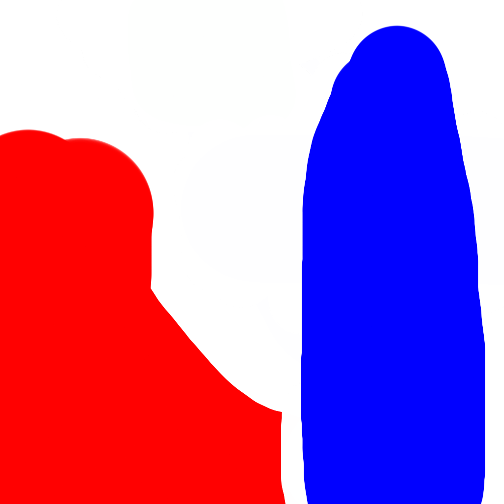
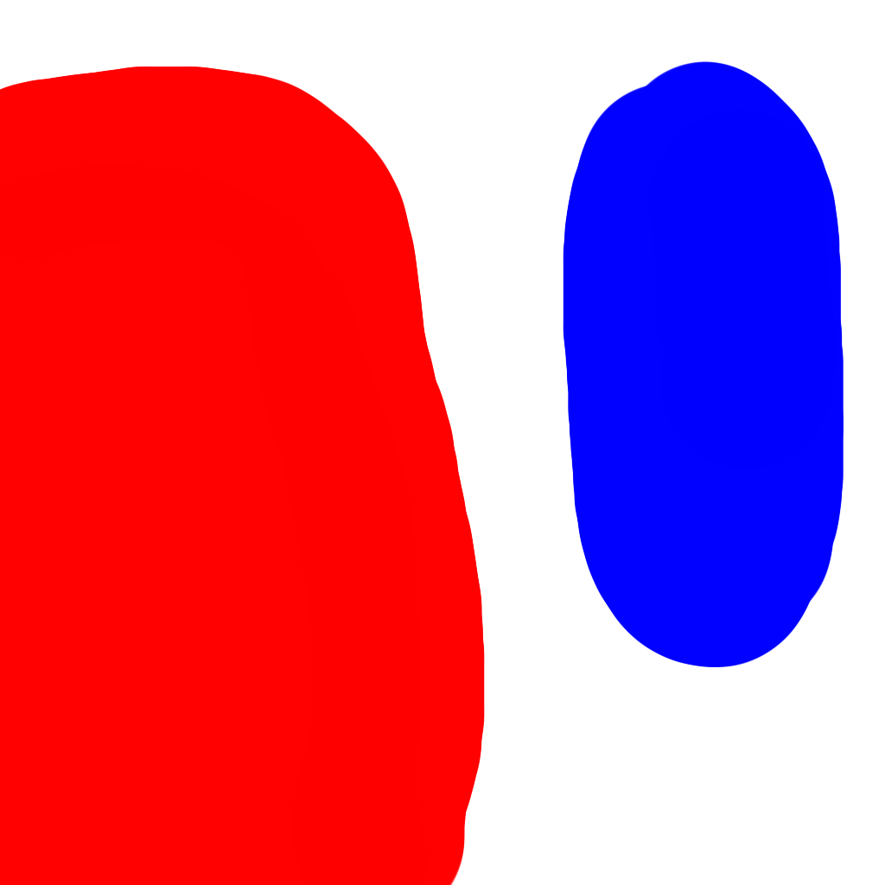
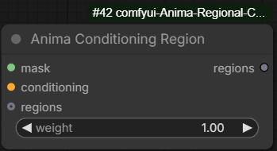
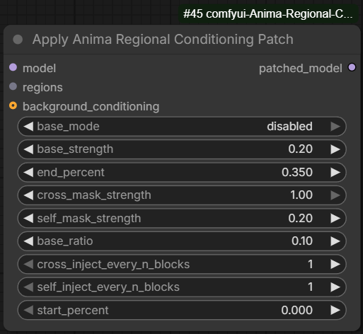

# Comfyui-Anima-Regional-Conditioning

Regional conditioning custom nodes for Anima models in ComfyUI.

## What It Does

This node lets you assign different text conditionings to different masked
regions of the latent image. It is intended for Anima image models and patches
the diffusion model during sampling.

In short:

- Cross-attention is routed so latent tokens inside a mask attend to that
  region's conditioning tokens.
- Self-attention can also be masked so latent tokens mostly attend to other
  latent tokens in the same region.
- A base/background conditioning can still cover unmasked areas or the full
  image, depending on the selected mode.

The patch is temporary: attention ops are replaced during the diffusion model
call and restored afterward.

## Examples

| Example | Region Masks | Result |
| --- | --- | --- |
| Example 1 |  |  |
| Example 2 |  |  |

## Nodes

### Anima Conditioning Region



Creates one region entry. Multiple region nodes can be chained together.

Parameters:

- `mask`: The mask defining where this region applies.
- `conditioning`: The conditioning prompt for this region.
- `weight`: Region strength. A value of `0` disables the region mask.
- `regions`: Optional previous region chain input, used to add more regions.

### Apply Anima Regional Conditioning Patch



Applies the regional conditioning patch to an Anima model.

Recommended tested values:

| Parameter | Value |
| --- | --- |
| `base_mode` | `disabled` |
| `base_strength` | `0.20` |
| `start_percent` | `0.000` |
| `end_percent` | `0.350` |
| `cross_mask_strength` | `1.00` |
| `self_mask_strength` | `0.20` |
| `base_ratio` | `0.10` |
| `cross_inject_every_n_blocks` | `1` |
| `self_inject_every_n_blocks` | `1` |

Parameters:

- `model`: The Anima model to patch.
- `regions`: Region chain created by one or more `Anima Conditioning Region`
  nodes.
- `base_mode`: Controls where the base/background conditioning applies.
  - `uncovered_only`: Base conditioning applies only outside region masks.
  - `global`: Base conditioning applies everywhere.
  - `disabled`: Base conditioning is not used for regional routing.
- `base_strength`: Strength of the base/background mask.
- `start_percent`: Sampling percent where the patch starts applying.
- `end_percent`: Sampling percent where the patch stops applying.
- `cross_mask_strength`: How strongly cross-attention is region-masked.
  `1.0` is a hard mask; lower values make the routing softer.
- `self_mask_strength`: How strongly self-attention is region-masked.
  Higher values reduce latent-token mixing across different regions.
- `base_ratio`: Blends some unpatched model output back into the regional
  output. Useful for preserving global coherence.
- `cross_inject_every_n_blocks`: Applies cross-attention routing every N
  transformer blocks.
- `self_inject_every_n_blocks`: Applies self-attention routing every N
  transformer blocks.
- `background_conditioning`: Optional conditioning used as the base/background
  prompt. If omitted, the original model context is used.

## Installation

Clone this repository into your ComfyUI `custom_nodes` directory:

```bash
cd ComfyUI/custom_nodes
git clone https://github.com/Sen-sou/Comfyui-Anima-Regional-Conditioning.git
```

Then restart ComfyUI.

For ComfyUI portable installs on Windows, the target folder is usually:

```text
ComfyUI_windows_portable/ComfyUI/custom_nodes
```

After restarting, the nodes should appear under:

```text
conditioning/Anima Regional Conditioning
```

## Current Limitations

- High `self_mask_strength` values can create hard edges or visible separation
  between regions.
- Because cross-attention and self-attention routing reduce mixing between
  regions, each region can have limited awareness of the others. This may cause
  unnatural composition, especially where regions interact.
- `base_ratio` and a good base/background prompt can help blend the regional
  output back into a more coherent full image.
- This approach is still experimental and may produce inconsistent or poor
  results depending on the prompt, masks, model, and settings.

## Notes

- This node supports Anima models only.
- Region masks are resized to the model token grid internally.
- Overlapping masks are allowed; overlapping latent tokens can belong to more
  than one region.
- Very high self-attention masking can make regions more isolated, but may also
  reduce overall image coherence.

## Credits

- Developed with assistance from Codex.
- [Haoming02/sd-forge-couple](https://github.com/Haoming02/sd-forge-couple)
- [instantX-research/Regional-Prompting-FLUX](https://github.com/instantX-research/Regional-Prompting-FLUX)
